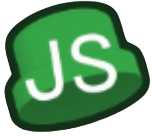

<h1 align="center">
   
  
   
  <b>JS Engine</b>
   
</h1>
<h3 align="center">
  <b>JS Engine is a heavily modified Psych Engine fork I made, with lower-end PCs and more customization in mind while also aiming to be a replacement for OS Engine.</b>
</h3>

README.md revamped by [Nael2xd](https://youtube.com/@nael2xd?si=axwJrY_8jdlXUwSm)

## Welcome

Hello and welcome to JS Engine's github repo, where you can download the engine and make spammy charts or have fun with the engine.

This contains lots and lots of customizable and features built in to JS Engine, if you wanna see most of them listed, you can see it below this text

# Features/Performances in JS ENGINE

This fork of this engine has tons of features and performances, most will be listed but some of them won't because there's a lot of it.

The features/performances included are:
- No BotPlay lag!
- Faster Song Loading!
- Loading songs longer than 20 minutes!
- Note Performance!
- Loading 100k+ notes without closing the window!
- Basic Shader Support! (for a full list, it can be seen in [here](https://github.com/JordanSantiagoYT/FNF-JS-Engine/wiki#q-what-are-all-the-basic-shaders-that-come-with-this-engine))
- Rendering mode! (Originally used for lua and gamerenderer-engine)
- Built in Song Credits! (on chart editor)

There is like lots and lots of stuff i've missed, but at least you would like those features built in **JS ENGINE**

# Screenshots

Here are some screenshots of what the engine looks like. 

# FAQs

Frequently Asked Questions (FAQs) are found in [here](https://github.com/JordanSantiagoYT/FNF-JS-Engine/wiki) or you can simply see it below.

Q: Can I use this engine for my mod(s)?

A: Yes, you can! just be sure to credit me (@JordanSantiago on YouTube) and give a link to this page. or [the link to download the latest release.](https://github.com/JordanSantiagoYT/FNF-JS-Engine/releases/latest)

Q: How do I (change the background, add characters, etc.)?

A: You do it here the same way you'd do it in Psych Engine.

# Compiling JS Engine

Refer to [the Build Instructions](./BUILDING.md)

If you get an error related to hxCodec, run `haxelib set hxCodec 2.5.1`
If graphics are all white and don't have color, run `haxelib git hxcpp https://github.com/HaxeFoundation/hxcpp`

## Customization:

if you wish to disable things like *Lua Scripts* or *Video Cutscenes*, you can read over to `Project.xml`

inside `Project.xml`, you will find several variables to customize JS Engine to your liking

to start you off, disabling Videos should be simple, simply Delete the line `"VIDEOS_ALLOWED"` or comment it out by wrapping the line in XML-like comments, like this `<!-- YOUR_LINE_HERE -->`

same goes for *Lua Scripts*, comment out or delete the line with `LUA_ALLOWED`, this and other customization options are all available within the `Project.xml` file

  
<h2>OG Psych Engine Credits and Stuff</h2>

  
* Shadow Mario - Programmer
* RiverOaken - Artist

### Special Thanks
* bbpanzu - Ex-Programmer
* SqirraRNG - Crash Handler and Base code for Chart Editor's Waveform
* KadeDev - Fixed some cool stuff on Chart Editor and other PRs
* iFlicky - Composer of Psync and Tea Time, also made the Dialogue Sounds
* PolybiusProxy - .MP4 Video Loader Library (hxCodec)
* Keoiki - Note Splash Animations
* Smokey - Sprite Atlas Support
* Nebula the Zorua - LUA JIT Fork and some Lua reworks
_____________________________________

# Features

## Attractive animated dialogue boxes:

## Mod Support
* Probably one of the main points of this engine, you can code in .lua files outside of the source code, making your own weeks without even messing with the source!
* Comes with a Mod Organizing/Disabling Menu.

## Atleast one change to every week:
### Week 1:
  * New Dad Left sing sprite
  * Unused stage lights are now used
### Week 2:
  * Both BF and Skid & Pump does "Hey!" animations
  * Thunders does a quick light flash and zooms the camera in slightly
  * Added a quick transition/cutscene to Monster
### Week 3:
  * BF does "Hey!" during Philly Nice
  * Blammed has a cool new colors flash during that sick part of the song
### Week 4:
  * Better hair physics for Mom/Boyfriend (Maybe even slightly better than Week 7's :eyes:)
  * Henchmen die during all songs. Yeah :(
### Week 5:
  * Bottom Boppers and GF does "Hey!" animations during Cocoa and Eggnog
  * On Winter Horrorland, GF bops her head slower in some parts of the song.
### Week 6:
  * On Thorns, the HUD is hidden during the cutscene
  * Also there's the Background girls being spooky during the "Hey!" parts of the Instrumental

## Cool new Chart Editor changes and countless bug fixes

* You can now chart "Event" notes, which are bookmarks that trigger specific actions that usually were hardcoded on the vanilla version of the game.
* Your song's BPM can now have decimal values
* You can manually adjust a Note's strum time if you're really going for milisecond precision
* You can change a note's type on the Editor, it comes with two example types:
  * Alt Animation: Forces an alt animation to play, useful for songs like Ugh/Stress
  * Hey: Forces a "Hey" animation instead of the base Sing animation, if Boyfriend hits this note, Girlfriend will do a "Hey!" too.

## Multiple editors to assist you in making your own Mod

* Working both for Source code modding and Downloaded builds!

## Story mode menu rework:

* Added a different BG to every song (less Tutorial)
* All menu characters are now in individual spritesheets, makes modding it easier.

## Credits menu

* You can add a head icon, name, description and a Redirect link for when the player presses Enter while the item is currently selected.

## Awards/Achievements
* The engine comes with 16 example achievements that you can mess with and learn how it works (Check Achievements.hx and search for "checkForAchievement" on PlayState.hx)

## Options menu:
* You can change Note colors, Delay and Combo Offset, Controls and Preferences there.
 * On Preferences you can toggle Downscroll, Middlescroll, Anti-Aliasing, Framerate, Low Quality, Note Splashes, Flashing Lights, etc.

## Other gameplay features:
* When the enemy hits a note, their strum note also glows.
* Lag doesn't impact the camera movement and player icon scaling anymore.
* Some stuff based on Week 7's changes has been put in (Background colors on Freeplay, Note splashes)
* You can reset your Score on Freeplay/Story Mode by pressing Reset button.
* You can listen to a song or adjust Scroll Speed/Damage taken/etc. on Freeplay by pressing Space.
